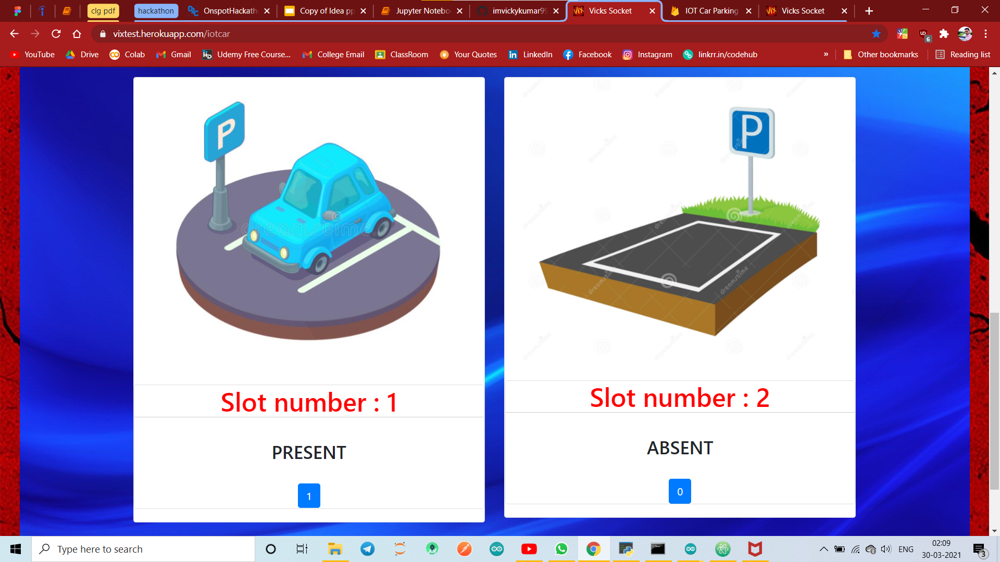

# [IOT Car Parking](https://github.com/imvickykumar999/web2app#output) Android App

## New Update : [Listen News](https://imvickykumar999.herokuapp.com/news) or, Listen/Download [YouTube Playlist](https://imvickykumar999.herokuapp.com/vickstube?vix=https://www.youtube.com/watch?v=Ps4aVpIESkc&list=PL9bw4S5ePsEEqCMJSiYZ-KTtEjzVy0YvK) Audio/Video with OFF screen feature, [Payments](https://github.com/imvickykumar999/payments).

## >>> pip install -r requirements.txt

## >>> Run `heroku logs -t -a imvickykumar999` in CMD to check [errors](https://github.com/imvickykumar999/hackathon-iot-car-parking/blob/main/heroku%20logs.png?raw=true) in [deployed site](https://imvickykumar999.herokuapp.com/iotcar).

### [Reason behind the issue is that these COWIN APIs are geofenced and no server outside the Indian region would work because of geo-fencing. You might be getting "Internal Server Error" after deploying your app on heroku and must be working fine when running locally.](https://github.com/cowinapi/developer.cowin/issues/403#issue-912946019)

# 🔥 Project: [Home Automation](https://www.linkedin.com/posts/imvickykumar999_esp32-androidapp-okgoogle-activity-6799109517461209088-b5yc)

    Step by Step to Create Your Own Home Automation Website and Android App using my YouTube Playlist: https://lnkd.in/dPUvESP

    Clone or Download ZIP of GitHub Repository: https://lnkd.in/dvDYGCs

    Home Automation Website: https://lnkd.in/d5zjtAn

    Python Package Index: https://lnkd.in/dkXyxGx

    Tags: #ESP32 || #AndroidApp || #OkGoogle || #Heroku || #Firebase || #Adafruit || #Github || #IFTTT || #Arduino || #PYPI || #HomeAutomation || #Project

## >>> These 2 files are large... need to download and put at [proper folder](https://github.com/imvickykumar999/Car-Plate-OCR) manually.
  - [tesseract ocr.exe](https://digi.bib.uni-mannheim.de/tesseract/tesseract-ocr-w64-setup-v4.1.0-bibtag19.exe)
  - [yolov3.weights](https://pjreddie.com/media/files/yolov3.weights)

## Download [my IOT App](https://github.com/imvickykumar999/hackathon-iot-car-parking/blob/main/Android-Web-App/web2app-master/app/outputs/apk/debug/app-debug.apk)

## Download [my Car Remote Controller App](https://github.com/imvickykumar999/hackathon-iot-car-parking/raw/main/hackathon/NodeMCU_Car.apk)

### Helpful Stackoverflow answers in this [this project](https://github.com/imvickykumar999/hackathon-iot-car-parking/blob/main/requirements.txt)...
  - https://stackoverflow.com/a/67429430/11493297
  - https://github.com/eventlet/eventlet/issues/702#issuecomment-833124692
